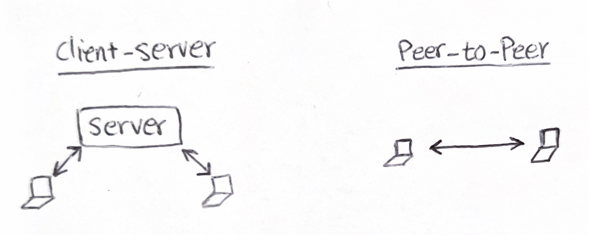

# PackSpaces

> Create a one-page "zoom" alternative using Socket.io and Peer.js

Watch this video, in some ways we really need to think how things connect to each other in this level:

```|{type:'youtube', url: 'https://www.youtube.com/embed/8OMonoKzkTc', start: 3, end: 34, autoplay: false, mute: false, width: 800, height: 465}
```

<br>

WebRTC is a technology that enables web applications to capture and stream video and/or audio (or other arbitrary data). WebRTC is already included in your web browser. Read more [here](https://developer.mozilla.org/en-US/docs/Web/API/WebRTC_API).



Because WebRTC Can get complicated to use directly there are wrapper packages that makes things really easy. The package we will be using is [Peer.js](https://peerjs.com/). Peer.js simply gives you an id, and allows you to attemp calling other peers knowing their id. 

```js
const peer = new Peer(); 

peer.on('open', (peerId) => {
    // our peer id is = peerId
    // others can now attempt to call us with this id
});
```

Something important to note here is that the peers don't automagically know our id (and we don't know theirs). So we need to take care of that initial signaling ourselves. This seems like a good place to use WebSockets (socket.io).

In frontend, as soon as we know what out peer id is, we can send it the socket.io backend, and the backend can broadcast that id to everyone else who is already connected!

In frontend:

```js
const peer = new Peer(); 

peer.on('open', (peerId) => {
    socket.emit('join-space', peerId); // <--- this emits a message to socket.io server
});
```

And in backend:

```js
io.on('connection', (socket) => {

    socket.on('join-space', (peerId) => {
        // New user connected, and their peer id is peerId!

        // I'm letting everyone else know a new use has connected
        socket.broadcast.emit('user-connected', peerId);
    });

});
```

It's very important to note how the communication is started, you should think very low level (similar to the video on top of this page):

1. We (and everyone else who was already connected) are notified there is a new peerId
2. Everyone calls this new peer and send them the video stream
3. The peer should respond to the calls and send back their stream

---

**Cool, so clients will be notified of a new peerId that just connected, but how can we send/receive their video stream? This what you will be working on today**

First piece of the puzzle is to get access to the computer's webcam from the web browser ([See docs here](https://developer.mozilla.org/en-US/docs/Web/API/Navigator/getUserMedia)): 

```js
const getUserMedia = navigator.getUserMedia || navigator.webkitGetUserMedia || navigator.mozGetUserMedia;
getUserMedia({video: true, audio: true}, function(stream) {
    // stream contains our webcam video stream!!
}
```

Second is using peer.js to cell other peers knowing their id:

```js
const call = peer.call('another-peers-id', stream); // <--- calling the other peer and sending them our video stream
call.on('stream', function(theirStream) {
    // When they response, we will also get theirStream.
    // To display their video, we can create a <video> and set the src to theirStream
    // ...
});
```

Third is responding to the peer who is calling us:

```js
// wait for calls
peer.on('call', function(call) {
    
    // get our webcam video stream
    getUserMedia({video: true, audio: true}, function(stream) {

        // respond to the call with our webcam stream
        call.answer(stream);

        // and finally remember they also sent us theirStream
        call.on('stream', function(theirStream) {
            // To display their video, we can create a <video> and set the src to theirStream
            // ...
        });
  }

```

The 3 hints above should cover most of what you need to share your camera with me and see yourself on class projector screen! 👋


I'm going to show you their first step which is displaying my own webcam on the html. Then I will give you time to work on the rest of it.


## Steps

1. Clone this repository.

```
git clone https://github.com/CSC-WebApps/PackSpaces.git
```

2. Take a look at the completed implemention of backend in [index.js](./index.js). In this workshop we will be focusing on the frontend and the Peer.js part only! I'm providing a hosted backend for you, and you should be able to complete workshop by only working on [`./www/index.html`](./www/index.html).


3. To preview your progress, open [`./www/index.html`](./www/index.html) in your web browser (Chrome has worked more consistently in my experience).

---

Finished the workshop, and looking for another challenge?

Our app currently only has one space and everyone is joining there. Update the backend to support multiple spaces. For example, I want to have a space at `http://localhost:3000/CSC342` and someone else might want to go to another space at `http://localhost:3000/CSC100`.

Hint:

This is very similar to what we already have, there some smaller changes needed to make this work (mainly in socket.io server). See socket.io [rooms documentation](https://socket.io/docs/v4/rooms/).

